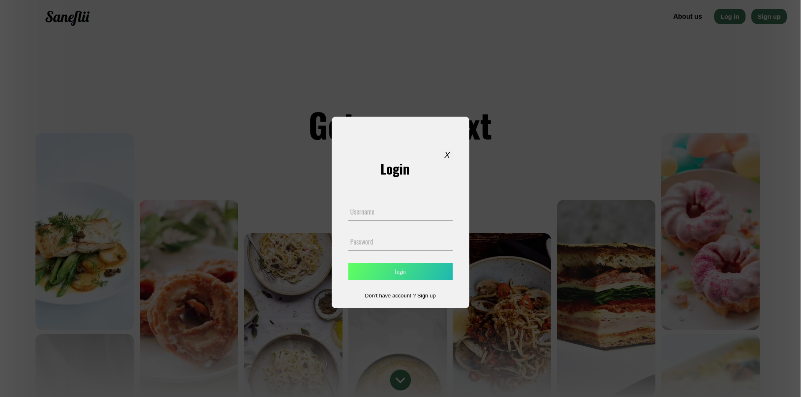
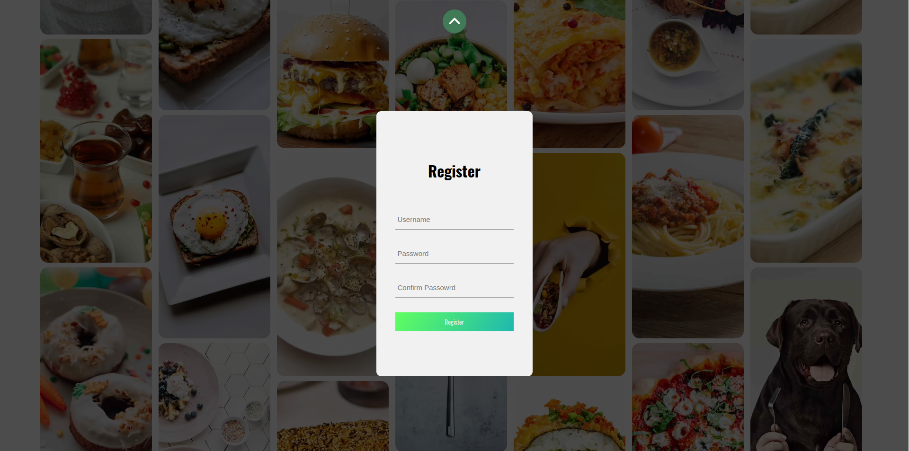
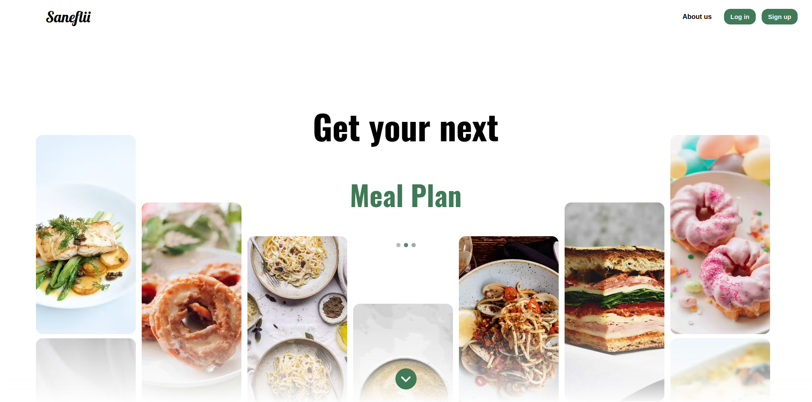
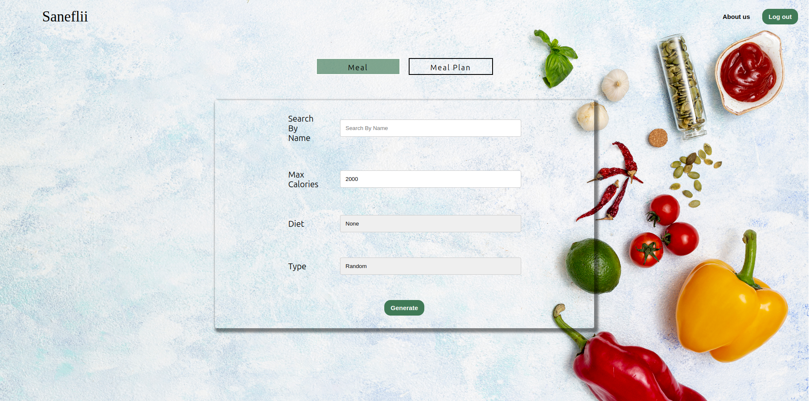
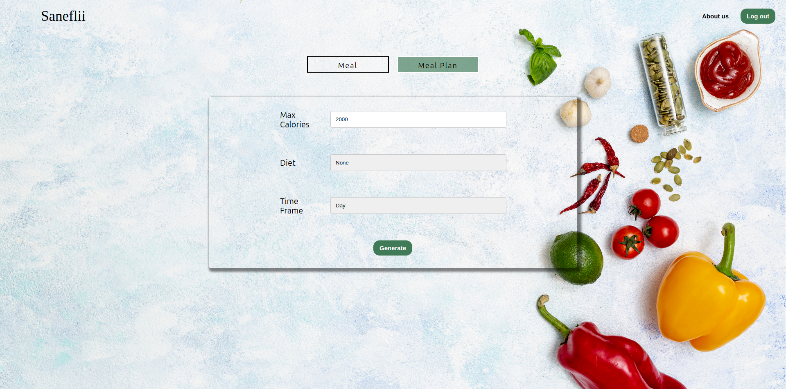
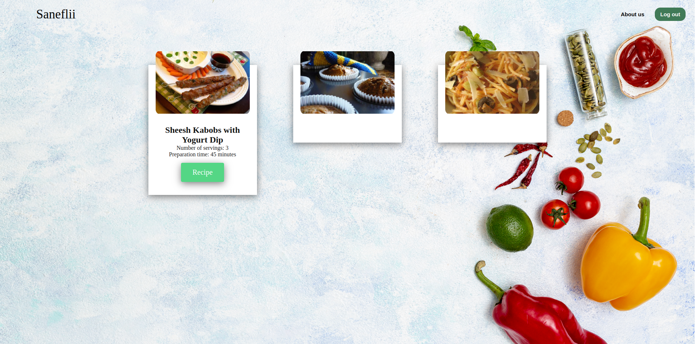
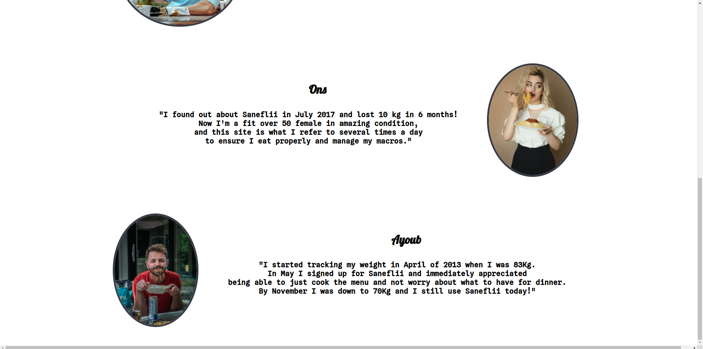
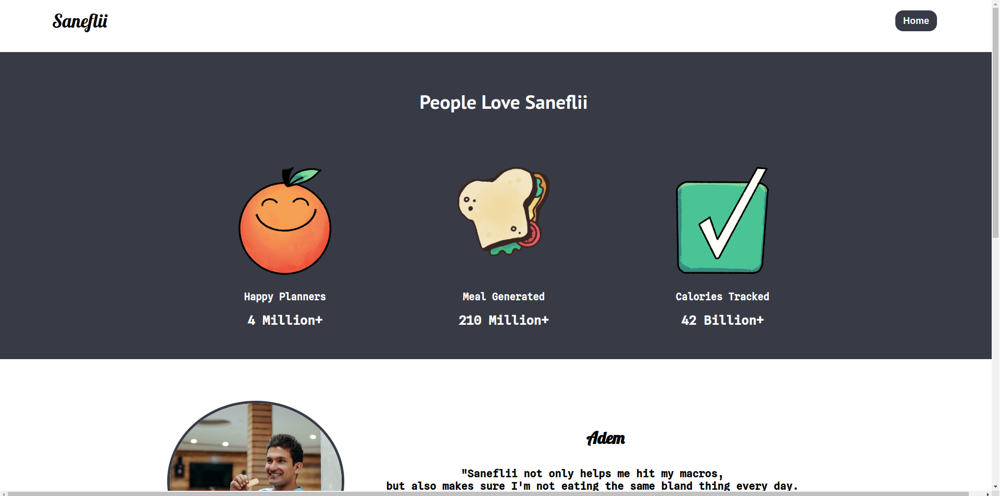

# Saneflii

Saneflii is a web-based meal planning and tracking application. It allows users to register, log in, and generate meal plans based on dietary preferences and calorie limits.

## Features

- User registration and authentication
- Meal and meal plan generation
- Calorie tracking
- Responsive front page with image slider
- About Us page with user testimonials

## Project Structure

- `fronttest.php` - Landing page with login/register forms and image slider
- `login.php` / `register.php` / `logout.php` - User authentication
- `home.php` - Main app page after login
- `aboutus.html` - About Us and testimonials
- `config.php` - Database configuration
- `Frontpage/` - CSS, JS, and images for the front page
- `Home/` - CSS, JS, and images for the home page
- `About us/` - Images and styles for About Us page
- `Fonts/` - Custom fonts and licenses

## Screenshots

## Login and Registration 

## Home and Results

## About Us Page 

## Setup

1. Clone the repository.
2. Set up a MySQL database and import the required tables (see `config.php` for credentials).
3. Place the project files in your web server directory.
4. Access `fronttest.php` in your browser.

## Dependencies

- PHP (mysqli extension)
- MySQL
- Google Fonts (see HTML files for usage)
- Font Awesome (CDN)

## License

See individual font licenses in the `Fonts/` directory. The rest of the code is provided as-is.

---

Cooked by Ayoub, Wejdene, Ahmed, and Yasser.